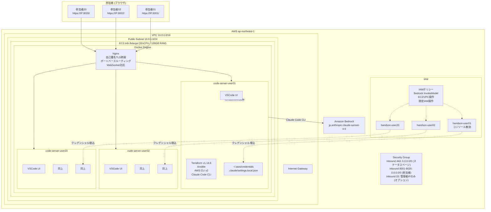

# ハンズオン用ブラウザVSCode環境構築

EC2 上に Docker + code-server (ブラウザ版 VSCode) を複数ユーザー分構築し、参加者がブラウザからアクセスするだけで Claude Code CLI によるエージェント開発を開始できる環境を自動構築します。

## 構成図



## 作成されるリソース一覧

`terraform apply` を実行すると、以下のリソースが自動的に作成されます。

| カテゴリ | リソース | 説明 |
|----------|----------|------|
| ネットワーク | VPC (10.0.0.0/16) | ハンズオン専用VPC |
| | Public Subnet (10.0.1.0/24) | EC2配置用 |
| | Internet Gateway | インターネット接続用 |
| | Route Table | パブリックルーティング |
| セキュリティ | Security Group | 443(ステータスページ) + 8001〜8020(参加者) + 22(管理者IP、オプション) |
| | SSH Key Pair | 管理者SSH用 (自動生成) |
| コンピュート | EC2 (m6i.8xlarge) | 32vCPU / 128GB RAM / 300GB gp3 |
| | Elastic IP | パブリックIP固定化 (停止・再起動してもIPが変わらない) |
| IAM | IAMユーザー x N | コンソールアクセス無効・プログラムアクセスのみ |
| | IAMポリシー | Bedrock + EC2/VPC + 限定IAM |
| | アクセスキー x N | ユーザーごとに自動生成 |

EC2 起動後、user-data スクリプトにより以下が自動構築されます。

| コンポーネント | 説明 |
|----------------|------|
| Docker Engine + Compose | コンテナ基盤 |
| handson-code-server イメージ | Terraform, Ansible, AWS CLI, Claude Code CLI 入り |
| Nginx コンテナ | 自己署名TLS終端 + ポートベースルーティング (443: ステータス, 8001〜: 参加者) |
| code-server コンテナ x N | 参加者ごとに独立した VSCode 環境 |
| AWS クレデンシャル | 各コンテナに `~/.aws/credentials` を配置済み |
| Claude Code 設定 | 各コンテナに `.claude/settings.local.json` を配置済み |
| Swap 8GB | メモリスパイク対策 |

## 事前準備

### 1. 管理者 PC に必要なツール

| ツール | バージョン | インストール方法 |
|--------|-----------|-----------------|
| Terraform | >= 1.5.0 | https://developer.hashicorp.com/terraform/install |
| AWS CLI | v2 | https://docs.aws.amazon.com/cli/latest/userguide/install-cliv2.html |
| jq | 任意 | 出力整形用 (なくても可) |

### 2. Bedrock モデルの有効化 (前日までに実施)

> **重要**: モデルの有効化には時間がかかる場合があるため、**ハンズオン前日までに完了** してください。

1. AWS コンソールにログイン
2. リージョンを **ap-northeast-1 (東京)** に切り替え
3. **Amazon Bedrock** > **Model access** に移動
4. **Claude Sonnet 4.6** のアクセスをリクエスト・有効化

### 3. Bedrock クォータの確認

20 人が同時に API を呼び出すため、レート制限に注意が必要です。

1. AWS コンソール > **Service Quotas** > **Amazon Bedrock**
2. `InvokeModel` および `InvokeModelWithResponseStream` のクォータを確認
3. 不足する場合は引き上げリクエストを送信 (反映に数日かかる場合あり)

## 実行手順

### Step 1: 設定ファイルの作成

```bash
# テンプレートをコピー
cp .env.template .env

# エディタで .env を編集
vi .env
```

`.env` に設定する項目:

| 変数 | 必須 | デフォルト値 | 説明 |
|------|:----:|-------------|------|
| `AWS_ACCESS_KEY_ID` | **必須** | - | 管理者の AWS アクセスキー |
| `AWS_SECRET_ACCESS_KEY` | **必須** | - | 管理者の AWS シークレットキー |
| `AWS_DEFAULT_REGION` | **必須** | ap-northeast-1 | AWS リージョン |
| `TF_VAR_user_count` | | 20 | 参加者数 |
| `TF_VAR_aws_region` | | ap-northeast-1 | AWS リージョン |
| `TF_VAR_instance_type` | | m6i.8xlarge | EC2 インスタンスタイプ |
| `TF_VAR_volume_size` | | 300 | EBS ボリュームサイズ (GB) |
| `TF_VAR_project_name` | | handson | リソース名のプレフィックス |
| `TF_VAR_admin_cidr` | | (未設定) | SSH アクセス元 CIDR (オプション) |

> **`TF_VAR_admin_cidr` について**: SSH アクセスの制御に使用します。
> | 設定値 | 動作 | 用途 |
> |--------|------|------|
> | 未設定 (デフォルト) | SSH ポートを閉じる | 本番ハンズオン |
> | `'203.0.113.0/32'` | 指定 IP のみ SSH 許可 | 管理者のみアクセス |
> | `'0.0.0.0/0'` | どこからでも SSH 可能 | 検証・デバッグ用 |

### Step 2: 環境変数の読み込み + 認証確認

```bash
# .env を読み込み
source .env

# AWS 認証が通るか確認 (必ず実施してください)
aws sts get-caller-identity
```

以下のような出力が表示されれば認証は正常です:

```json
{
    "UserId": "AIDAXXXXXXXXXXXXXXXXX",
    "Account": "123456789012",
    "Arn": "arn:aws:iam::123456789012:user/admin"
}
```

エラーが出る場合は `.env` の `AWS_ACCESS_KEY_ID` と `AWS_SECRET_ACCESS_KEY` を確認してください。特に **シングルクォート (`'`) で値を囲んでいるか** を確認してください (シークレットキーに `+` や `/` 等の特殊文字が含まれる場合、ダブルクォートだとシェルに解釈されてエラーになります)。

### Step 3: Terraform 初期化 + 環境構築

```bash
# Terraform 初期化 (初回のみ)
cd terraform
terraform init

# 環境構築
terraform apply
```

確認プロンプトで `yes` を入力すると構築が開始されます。Terraform の処理は約 2〜3 分で完了します。

### Step 4: セットアップ完了を待つ

Terraform 完了後、EC2 内で user-data スクリプトが自動実行されます (約 10〜15 分)。

#### ブラウザでステータス確認 (推奨)

セットアップの進捗状況はブラウザからリアルタイムで確認できます:

```bash
# ステータスページの URL を確認
terraform output setup_status_url
```

表示された URL (`https://<IP>/`) をブラウザで開いてください。自己署名証明書の警告は「詳細設定」>「安全でないサイトへ進む」で進みます。

ステータスページには以下が表示されます:

| 状態 | 表示 | 説明 |
|------|------|------|
| ⏳ **セットアップ進行中** | 青色バナー + 各ステップの進捗 | 5秒ごとに自動更新 |
| ✅ **セットアップ完了** | 緑色バナー + 全ステップ完了 | 参加者がアクセス可能 |
| ❌ **セットアップ失敗** | 赤色バナー + エラー詳細 | 失敗ステップとエラー内容を表示 |

> **注意**: ステータスページは TLS 証明書生成 (Step 4) 以降にアクセス可能になります。それ以前 (約 2〜3 分) はアクセスできません。

#### SSH で確認 (admin_cidr 設定時)

```bash
# SSH 秘密鍵を取得
terraform output -raw ssh_private_key > /tmp/handson-key.pem
chmod 600 /tmp/handson-key.pem

# 状態確認 (SETTING_UP / READY / FAILED)
ssh -i /tmp/handson-key.pem ec2-user@$(terraform output -raw ec2_public_ip) \
  'cat /opt/handson/setup-state'

# セットアップログの確認 (エラー時)
ssh -i /tmp/handson-key.pem ec2-user@$(terraform output -raw ec2_public_ip) \
  'cat /var/log/handson-setup.log'
```

### Step 5: 参加者への配布情報を取得

```bash
terraform output -json credentials_sheet \
  | jq -r '.[] | "ユーザー: \(.user)  URL: \(.url)  パスワード: \(.password)"'
```

出力例:

```
ユーザー: user01  URL: https://203.0.113.10:8001/  パスワード: Xk9mP2qR
ユーザー: user02  URL: https://203.0.113.10:8002/  パスワード: Lm3nY8wZ
...
```

この一覧を参加者に配布してください。

## 参加者向けの操作方法

### アクセス手順

1. 配布された **URL** をブラウザで開く
2. 自己署名証明書の警告が表示されるため「**詳細設定**」>「**安全でないサイトへ進む**」を選択
3. 配布された **パスワード** を入力
4. VSCode がブラウザ上で開く

### ターミナルの使い方

VSCode のターミナル (`Ctrl + @`) を開くと、以下のコマンドが即座に利用可能です。

```bash
# AWS 認証の確認 (設定済み)
aws sts get-caller-identity

# Terraform
terraform version

# Ansible
ansible --version

# Claude Code CLI (Bedrock 設定済み)
claude
```

## ハンズオン終了後の片付け

### 1. 参加者が作成したリソースの削除

> **重要**: 参加者がハンズオン中に Terraform/Ansible で作成した AWS リソース (EC2, VPC 等) は、このプロジェクトの `terraform destroy` では削除されません。

ハンズオン手順に後片付けステップを含めるか、または [aws-nuke](https://github.com/rebuy-de/aws-nuke) 等を使って一括削除してください。

### 2. ハンズオン基盤の削除

```bash
cd terraform

# .env が読み込まれていることを確認 (新しいターミナルの場合は再度 source)
source ../.env

# 全リソースを一括削除
terraform destroy
```

### 3. Terraform state ファイルの削除

`terraform.tfstate` には IAM アクセスキーが平文で含まれます。`terraform destroy` 完了後、state ファイルも削除してください。

```bash
rm -f terraform.tfstate terraform.tfstate.backup
```

## トラブルシューティング

### セットアップ失敗の確認方法

**方法 1: ブラウザで確認 (推奨)**

`https://<EC2のIP>/` にアクセスすると、どのステップで失敗したかをエラー詳細とともに確認できます。ステータスページはセットアップ中も失敗後も表示されます。

**方法 2: SSH で確認 (admin_cidr 設定時)**

```bash
# 状態確認 (SETTING_UP / READY / FAILED)
ssh -i /tmp/handson-key.pem ec2-user@$(terraform output -raw ec2_public_ip) \
  'cat /opt/handson/setup-state'

# エラー内容の確認
ssh -i /tmp/handson-key.pem ec2-user@$(terraform output -raw ec2_public_ip) \
  'cat /opt/handson/setup-error'

# 詳細ログの確認
ssh -i /tmp/handson-key.pem ec2-user@$(terraform output -raw ec2_public_ip) \
  'cat /var/log/handson-setup.log'
```

**方法 3: AWS コンソールから確認 (SSH 不要)**

EC2 コンソール → インスタンスを選択 → **アクション** → **モニタリングとトラブルシューティング** → **システムログを取得** でセットアップログを閲覧できます。

### code-server にアクセスできない

1. EC2 のパブリック IP を確認: `terraform output ec2_public_ip`
2. ブラウザで `https://<IP>/` にアクセスし、セットアップが完了しているか確認
3. `admin_cidr` を設定して SSH 可能にし、Docker コンテナの状態を確認:

```bash
ssh -i /tmp/handson-key.pem ec2-user@$(terraform output -raw ec2_public_ip) \
  'cd /opt/handson && sudo docker compose ps'
```

### Claude Code CLI が Bedrock に接続できない

1. Bedrock モデルのアクセスが有効化されているか確認
2. コンテナ内の設定ファイルを確認:

```bash
ssh -i /tmp/handson-key.pem ec2-user@$(terraform output -raw ec2_public_ip) \
  'sudo docker exec handson-user01 cat /home/coder/workspace/.claude/settings.local.json'
```

3. コンテナ内から AWS 認証が通るか確認:

```bash
ssh -i /tmp/handson-key.pem ec2-user@$(terraform output -raw ec2_public_ip) \
  'sudo docker exec handson-user01 aws sts get-caller-identity'
```

### 特定ユーザーのコンテナを再起動したい

```bash
ssh -i /tmp/handson-key.pem ec2-user@$(terraform output -raw ec2_public_ip) \
  'cd /opt/handson && sudo docker compose restart code-server-user01'
```

## コスト見積もり

| リソース | 単価 (ap-northeast-1) | 8時間あたり |
|----------|----------------------|------------|
| EC2 m6i.8xlarge | 約 $2.46/時間 | 約 $20 |
| EBS 300GB gp3 | 約 $0.096/GB/月 | 約 $0.03 |
| Elastic IP (実行中) | $0.005/時間 | 約 $0.04 |
| データ転送 | 最初の 100GB 無料 | $0 |
| **合計** | | **約 $20** |

> IAM ユーザー・ポリシーに料金はかかりません。Bedrock の利用料金は別途発生します。

> **Elastic IP の注意点**: Elastic IP は EC2 インスタンスに関連付けられている間は $0.005/時間 の料金が発生します。`terraform destroy` で EIP も自動削除されるため、ハンズオン終了後に destroy すれば追加コストは無視できるレベルです。ただし、**EC2 を停止して EIP だけ残した場合も同額が課金される**ため、不要になったら必ず `terraform destroy` で削除してください。
